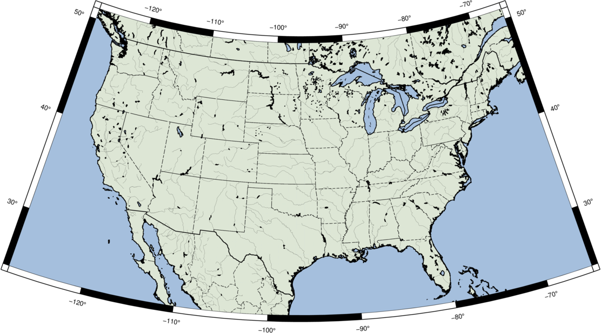

# GMT (Generic Mapping Toolbox) in Docker

Full installation of GMT (Generic Mapping Toolbox) in convenient Docker container

# Usage

## Building the container

```
docker build -t gmt:6.4.0 .
```

## Using the container
Create alias within `.bashrc` / `.zshrc`:
```
alias gmt-docker='docker run --rm -v "$PWD/:/root/work/" -i -t gmt:6.4.0'
```

Use `gmt-docker` followed by `gmt` command. Following example creates map of the USA and converts it to `.png` format:
```
gmt-docker gmt set FONT_ANNOT_PRIMARY 5p,Helvetica
gmt-docker gmt psbasemap -R-128/-65/24/51 -Jl-96.5/40/23/52/1:40000000 -B10g2 -K -P > USA.ps
gmt-docker gmt pscoast -R -Df -Ia/0.03p,black -J -N1/0.5p -N2/0.25p,- -G#dde6d5 -S#a5bfdd -A0/0/4 -W0.5p,black -O -P >> USA.ps
gmt-docker convert -geometry 4096x4096 -density 600 -trim USA.ps USA.png
```


